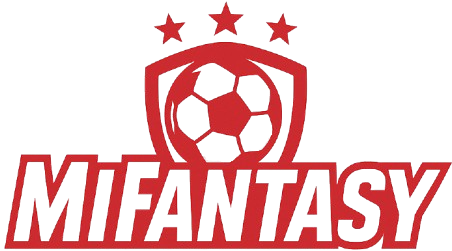

# Sobre MiFantasy
MiFantasy es una aplicación web que permite crear y gestionar ligas fantasy personalizadas a partir de torneos de fútbol no profesionales, como competiciones locales, amateur o solidarias. El proyecto surge como una alternativa flexible a las plataformas fantasy tradicionales, habitualmente limitadas a ligas oficiales, permitiendo adaptar el sistema fantasy a contextos más cercanos y personalizados.

Este proyecto se desarrolla como **Trabajo Fin de Máster (TFM)** y plantea, como posible caso de uso real, su aplicación en torneos solidarios de fútbol sala como la **OnddoCup**.


## ⚽ Funcionalidad general

La aplicación distingue dos roles principales:

### 👤 Usuario
- Registro e inicio de sesión.
- Creación de liguillas fantasy privadas.
- Participación en liguillas creadas por otros usuarios.
- Selección de jugadores de un torneo.
- Gestión de una alineación guardada.
- Competición por jornadas.
- Visualización de clasificaciones.

### 🛠️ Administrador
- Creación y gestión de torneos.
- Definición de equipos, jugadores y jornadas.
- Control del estado de las jornadas.
- Gestión del sistema de puntuación.

Las alineaciones funcionan de forma similar a las fantasy convencionales: los usuarios configuran una alineación que queda bloqueada al inicio de cada jornada y compiten con ella durante la misma. La puntuación de los jugadores se calcula de forma automática mediante reglas predefinidas, aunque en el estado actual del proyecto dichas puntuaciones son temporales.


## 🖥️ Tecnologías utilizadas
- **Backend:** Laravel (PHP)
- **Frontend:** Blade, Bootstrap y JavaScript
- **Base de datos:** MySQL
- **Contenedores:** Docker y Docker Compose
- **Gestión de correos:** Mailtrap (entorno de desarrollo)
- **Testing:** PHPUnit

La aplicación está completamente dockerizada, lo que permite ejecutar una demo funcional en cualquier ordenador sin necesidad de instalar PHP, MySQL u otros servicios adicionales.


## 🚀 Ejecución del proyecto (Demo local con Docker)

### Requisitos
- Docker Desktop
- Git (opcional, si se clona el repositorio)


### 1️⃣ Clonar el proyecto o descomprimir el ZIP
```bash
git clone https://github.com/usuario/MiFantasy.git
cd MiFantasy
```

### 2️⃣ Configurar las variables de entorno
Copiar el archivo de ejemplo de configuración:
```bash
git clone https://github.com/usuario/MiFantasy.git
cd MiFantasy
```

### 3️⃣ Levantar los contenedores
```bash
docker compose up -d
```
Esto iniciará:

- Aplicación Laravel

- Servidor web (Nginx)

- Base de datos MySQL

- phpMyAdmin

### 4️⃣ Preparar la aplicación Laravel
```bash
docker exec -it mifantasy_app composer install
docker exec -it mifantasy_app php artisan key:generate
docker exec -it mifantasy_app php artisan migrate
docker exec -it mifantasy_app php artisan optimize:clear
```

## 🌐 Acceso a la aplicación

### 📦 Inicialización de datos

MiFantasy dispone de una ruta de inicialización pensada para entornos de desarrollo
y demostración.

Al acceder a la siguiente URL, el sistema crea automáticamente los datos necesarios
para poder utilizar la aplicación:
```arduino 
http://localhost:8080/poblar
```

Esto incluye:
- Usuarios de prueba
- Torneos base
- Jugadores
- Reglas de puntuación iniciales

⚠️ Esta acción debe ejecutarse **una única vez** tras la instalación del proyecto.

### 🖥️ Aplicación web (local):
**URL:**  
```arduino 
http://localhost:8080
```

**Credenciales:**
- Usuario: `Admin`
- Contraseña: `123456789`

### 🌍 Aplicación web (ngrok)

Al levantar Docker, también se inicia un túnel ngrok que expone la aplicación al exterior.

- **Panel de ngrok (para ver la URL pública):**  
```arduino 
http://localhost:4040
```

La URL pública aparecerá como :
```arduino 
https://copesetic-jenelle-snoopily.ngrok-free.dev/
```  
Accede a la aplicación usando esa URL.

### 🗄️ phpMyAdmin:
**URL:** 
```arduino 
http://localhost:8081
```
**Credenciales:**
- Usuario: `root`

- Contraseña: `root`

## 🛑 Parar el proyecto
```bash
docker compose down
```

## 📚 Contexto académico
Este proyecto se desarrolla como Trabajo Fin de Máster, con el objetivo de diseñar e implementar una aplicación web completa que combine:

* Lógica de negocio compleja.
* Gestión de roles.
* Persistencia de datos.
* Arquitectura moderna basada en contenedores.
* Aplicabilidad en un entorno real.

## 🔮 Líneas de trabajo futuro
* Sistema definitivo de puntuaciones.
* Despliegue en servidor en producción.
* Integración de mercado de jugadores.
* Notificaciones automáticas a usuarios.
* Historial de jornadas y estadísticas avanzadas.


## ✏️ Autor
Proyecto desarrollado por Urki Aristu Viela

Trabajo Fin de Máster – Máster en Ingeniería Informática / UPNA