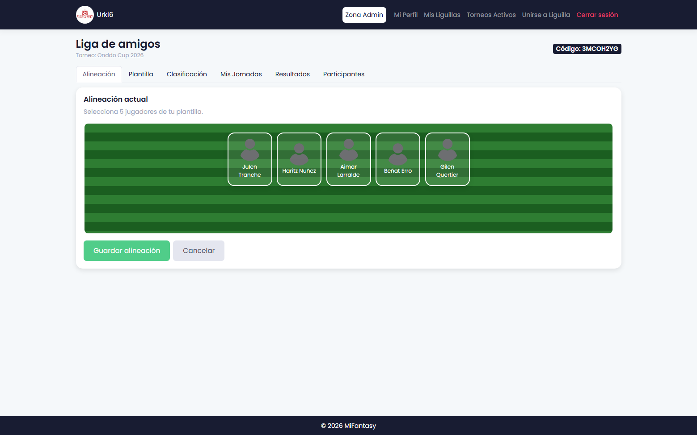
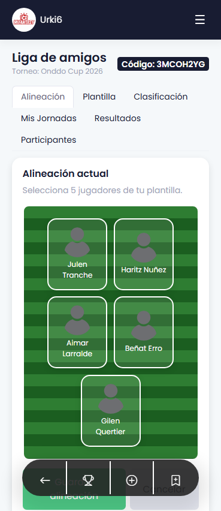
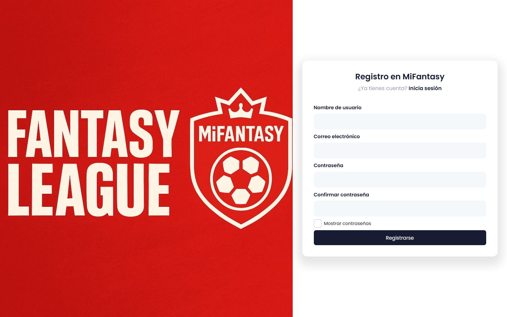
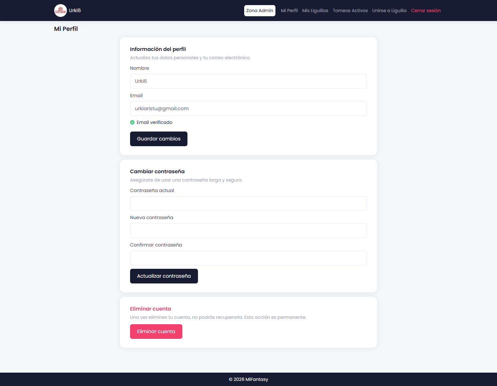
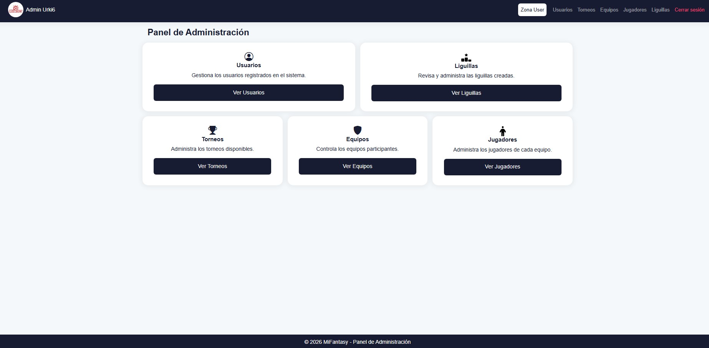

# Sobre MiFantasy 

MiFantasy es una aplicación web que permite crear y gestionar ligas fantasy personalizadas a partir de torneos de fútbol no profesionales, como competiciones locales, amateur o solidarias. El proyecto surge como una alternativa flexible a las plataformas fantasy tradicionales, habitualmente limitadas a ligas oficiales, permitiendo adaptar el sistema fantasy a contextos más cercanos y personalizados.

## ⚙️ Tecnologías utilizadas

El proyecto está construido bajo una arquitectura moderna, garantizando escalabilidad, persistencia de datos y adaptabilidad a dispositivos móviles:

- **Backend:** Laravel (PHP)
- **Frontend:** Blade, Bootstrap y JavaScript
- **Base de datos:** MySQL
- **Despliegue y Contenedores:** Docker y Docker Compose
- **Aplicación Web Progresiva (PWA):** Service Workers y Web App Manifest para instalación nativa en dispositivos.

## 🖥️ Interfaz y Experiencia de Usuario (UX/UI)

El diseño se ha centrado en ofrecer una experiencia fluida y completamente *responsive*, permitiendo a los usuarios gestionar sus equipos tanto desde el ordenador como desde el teléfono móvil.

### Panel principal de Liguilla
Centraliza gran parte de la actividad del usuario: alineación, plantilla, clasificación y resultados mediante un sistema de navegación rápido por pestañas.

| Versión Escritorio | Versión Móvil |
| :---: | :---: |
|  |  |

### Perfil de Usuario y Autenticación
Gestión completa de la cuenta, seguridad de contraseñas y opciones de persistencia de sesión.

| Registro y Autenticación | Gestión de Perfil |
| :---: | :---: |
|  |  |

### Panel de Administración
Cuadro de mando exclusivo para la gestión de torneos, equipos, jugadores, liguillas y usuarios.

| Dashboard de Administración |
| :---: |
|  |

## ⚽ Funcionalidad principal

La aplicación distingue dos roles principales de interacción:

### Usuario (Jugador)
- **Creación y participación:** Capacidad para unirse a ligas mediante códigos de invitación o crear liguillas privadas propias.
- **Gestión táctica:** Selección de jugadores, gestión de plantilla y configuración de la alineación titular.
- **Competición:** Las alineaciones se bloquean al inicio de cada jornada, compitiendo mediante un sistema de puntuación automatizado.
- **Instalación PWA:** Posibilidad de instalar la aplicación en iOS/Android directamente desde el navegador.

### Administrador (Gestor)
- **Mantenimiento de datos:** Creación y gestión de torneos, equipos y jugadores reales de la competición amateur.
- **Planificación:** Definición del calendario de jornadas y sus fechas límite de cierre.
- **Control global:** Supervisión del estado general de la competición y el sistema de puntuación.

## 🔮 Líneas de trabajo futuro

El proyecto establece una base sólida para el desarrollo continuo de nuevas funcionalidades:

* Despliegue en servidor de producción definitivo.
* Integración de un mercado de fichajes de jugadores dinámico.
* Sistema definitivo de cálculo de puntuaciones en tiempo real.
* Historial histórico de jornadas y estadísticas avanzadas para los participantes.
* Notificaciones automáticas (Push/Email) a usuarios sobre el estado de sus liguillas.
* Animaciones de transición y carga entre pantallas para mejorar la UX.

## 📚 Contexto académico y Autor

Este proyecto nace como idea de digitalizar un torneo solidario y aportar mayor participación involucrando al público con un juego tipo fantasy. A partir de esa iniciativa, se decidió llevar la idea a la universidad y convertirla en un Trabajo Fin de Máster, construyendo una plataforma real y completa desde cero.

**Autor:** Urki Aristu Viela  
**Contexto:** Trabajo Fin de Máster – Máster en Ingeniería Informática / UPNA

## 📄 Licencia y Derechos de Autor

Copyright © 2026 Urki Aristu Viela. Todos los derechos reservados.

Este repositorio contiene código protegido por las leyes de propiedad intelectual. Se permite su visualización pública exclusivamente con fines de demostración técnica y portafolio. Queda estrictamente prohibida la copia, reproducción, modificación, distribución o explotación comercial de todo o parte de este software sin la autorización expresa y por escrito del autor.
